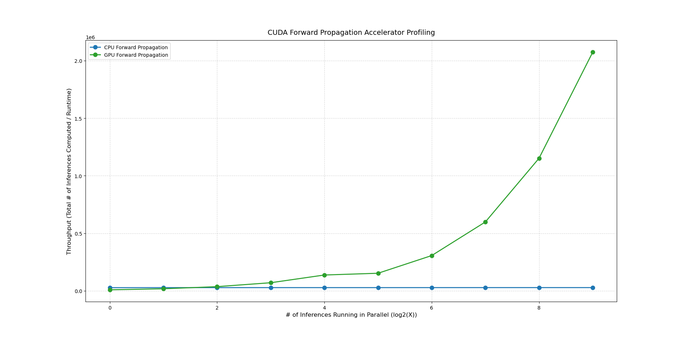
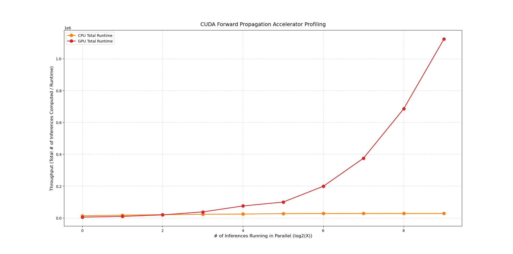
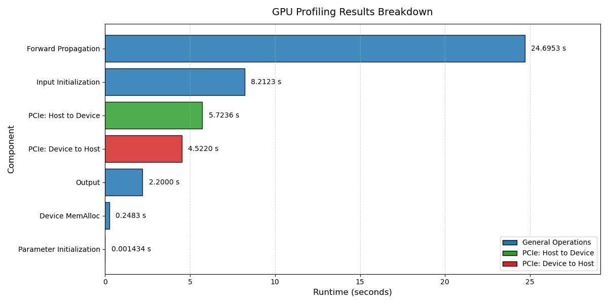

# FCUDA Inference Accelerator

This document is an indepth description and documentation of the GPU/CUDA-based forward propagation accelerator I built for my MNIST NN. In the future I plan to implement this accelerator onto an FPGA to compare the throughput with my custom Neural Inference Processing Unit(NIPU) chip.

## Table of Contents 
- [Overview](#overview)
- [CUDA Kernels](#cuda-kernels)
- [Results](#results)

## Overview

This program has both `cpu-version` and `gpu-version` branches that show the source code. The CPU version shows the basic forward-propagation code using to compute inferences for my MNIST Neural Network. The GPU version has the completed custom CUDA kernels for both matrix multiplication and sigmoid squishing. The majority of documentation in contained in the `main` branch and the `main` branch code most closely resembles the GPU version. 

The forward propagation code was built for my MNIST Neural Network (NN). For any NN using the MNIST dataset the standard task is digit classification. The NN takes in a 784 neuron input and spits out a 10 neuron output. With each of the 784 neurons in the input layer corresponding to one pixel in a 28x28 grid and each of the 10 neurons in the output layer corresponding to the integers 0-9. 

For my implementation, the NN also includes 2 hidden layers containing 16 neurons each. The choice of the number of hidden layers and the number of neurons in each layer was mostly arbitrary, as for this project I am aiming for an analysis of maximum throughput rather than optimizing numerical accuracy. 

## CUDA Kernels
In any given forward propagation/inference operation for this NN, the computation simply consists of a matrix multiply, an addition, and applying sigmoid activation function. We then repeat this process 3 times and we are left with 10 output neuron activations. 

The output of a fully connected layer can be expressed as a matrix multiplication between the weight matrix and the input activations, followed by the addition of a bias vector:

$$
\mathbf{y} = \mathbf{W}\mathbf{x} + \mathbf{b}
$$

where $x$ are the activations, $W$ is the weight matrix, and $b$ is the bias. 

Additionally we apply a sigmoid activation function to squish our outputs into a specified range:

$$
\sigma(x) = \frac{1}{1 + e^{-x}}
$$

In this case the function squishes all inputs $x$ into outputs $0 < y < 1$

Since these are the only two operations needed, the corresponding CUDA kernels are relatively simple. For adding the bias and apply the sigmoid, we simply apply a thread to each activation in a given layer. When running multiple inferences in parallel we simply need to make a choice of how to store these extra activations. In my case I decided to go with row-major order since it doesn't complicate the existing design. You can view the completed kernel at `src/math/activation_compressor.cu`.

For matrix multiplication, we apply one thread to each element in the product matrix. Additionally when running multiple inferences in parallel, we must store in row-major order. The completed kernel can be found at `src/math/matmul.cu`.

## Results
As expected, the performance speedup for forward propagation largely depends on the number of inferences running in parallel. When running only 1 inference in parallel, the CPU implementation outperforms the GPU implementation. This is because the GPU is only parallelizing at most 16 operations at once, but required expensive PCIe transfers and DRAM synchronization. In general, I used coalesced memory access and there were no instances of warp divergence. 

However, when running many inferences in parallel, the GPU implementation vastly outperforms the CPU implementation.

Below is a graph of the forward propagation throughput compared to a logarithmic scale of the number of inferences running in parallel. 

However, forward propagation does exclude the affect of PCIe transfer and DRAM sychronization.

As we can see the PCIe transfers and DRAM synchronization has little effect on the throughput of the GPU implementation, especially when the number of inferences running in parallel increased. 

